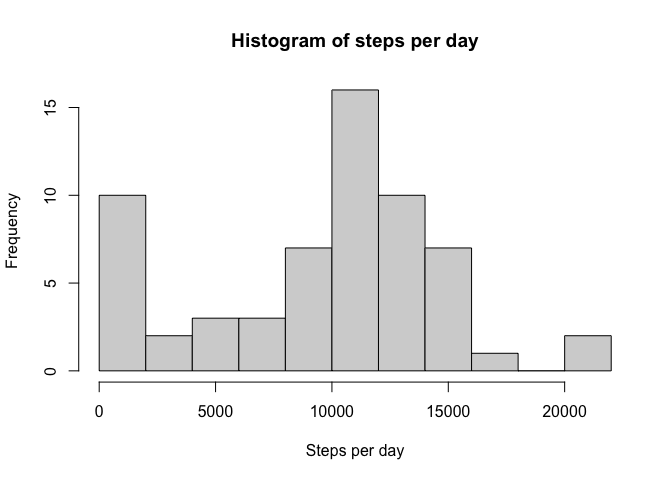
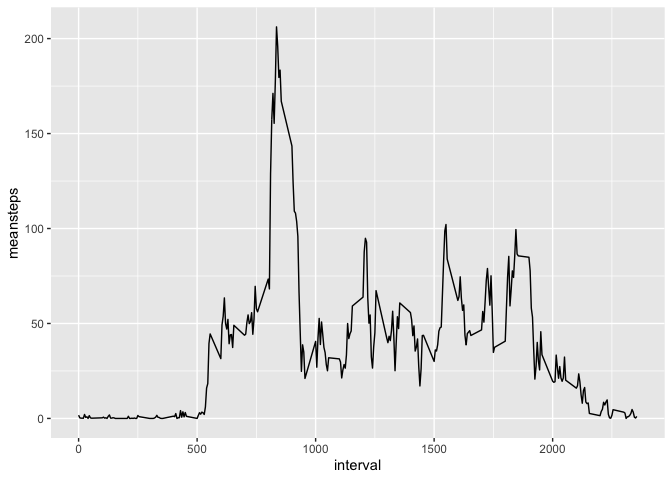
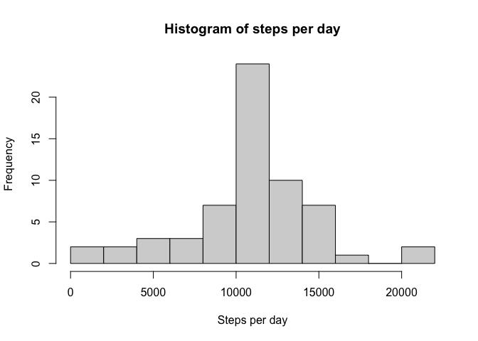
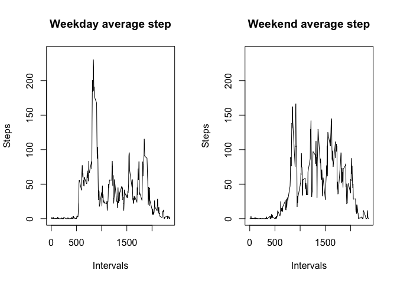

## Week 2 course project 1

## First question

Code for reading in the dataset and/or processing the data

Download, unzip and assign file to a vector, amd.

    fileUrl <- "https://d396qusza40orc.cloudfront.net/repdata%2Fdata%2Factivity.zip"
    download.file(fileUrl, destfile = "amd.zip")
    amd <- read.csv(unzip("amd.zip"))

## Second question

Histogram of the total number of steps taken each day

Calculate steps/day using aggregate() and then creating a histogram with
hist().

    steps <- aggregate(amd$steps, list(amd$date), sum, na.rm=TRUE)
    colnames(steps) <- c("date", "totalsteps")
    hist(steps$totalsteps, main="Histogram of steps per day", xlab="Steps per day", breaks=8)

## Third question

Mean and median number of steps taken each day.

    meansteps <- mean(steps$totalsteps)
    mediansteps <- median(steps$totalsteps)

The mean is 9354.2295082 steps/day and the median is 10395 steps/day.

## Fourth question

Time series plot of the average number of steps taken using ggplot2.

    library(ggplot2)
    stepsperinterval <- aggregate(amd$steps, list(amd$interval), mean, na.rm=TRUE)
    colnames(stepsperinterval) <- c("interval", "meansteps")
    ggplot(stepsperinterval, aes(x=interval))+geom_line(aes(y=meansteps))

## Fifth question

The 5-minute interval that, on average, contains the maximum number of
steps

    maxinterval <- which.max(stepsperinterval$meansteps)
    maxinterval2 <- stepsperinterval$meansteps[maxinterval]

The interval with highest average amount of steps was interval 104 with
an average of 206.1698113.

## Sixth question

Code to describe and show a strategy for imputing missing data.

Find how many NA’s there is in the steps column of amd. Create another
dataframe (amd2). Find the 5 min interval mean like before. Use a for
loop to replace Na’s with mean value. Count Na’s again, should be 0.

    sum(is.na(amd$steps))

    ## [1] 2304

    amd2 <- amd
    means <- aggregate(amd2$steps, list(amd2$interval), mean, na.rm=TRUE)
    colnames(means) <- c("interval", "meansteps")

    for(x in 1:17568) {
      if(is.na(amd2[x, 1])==TRUE) {
      amd2[x, 1] <- means[means$interval %in% amd2[x, 3], 2]
    }
    }
    sum(is.na(amd2$steps))

    ## [1] 0

## Seventh question

Histogram of the total number of steps taken each day after missing
values are imputed

    steps2 <- aggregate(amd2$steps, list(amd2$date), sum, na.rm=TRUE)
    colnames(steps2) <- c("date", "totalsteps")
    hist(steps2$totalsteps, main="Histogram of steps per day", xlab="Steps per day", breaks=8)

## Eighth question

Panel plot comparing the average number of steps taken per 5-minute
interval across weekdays and weekends

First find which days are which. Then subset based on if it’s a weekday
or the weekend. Find the mean in each 5-minute interval.

Then plot in a panel plot.

    amd2$date <- as.Date(amd2$date)
    weekdays <- weekdays(amd2$date)
    weekdays <- as.data.frame(weekdays)
    amd2 <- cbind(amd2, weekdays)

    weekendtable <- subset(amd2, weekdays=="Lördag" | weekdays=="Söndag")
    weekdaytable <- subset(amd2, weekdays=="Måndag" | weekdays=="Tisdag" | weekdays=="Onsdag" | weekdays=="Torsdag" | weekdays=="Fredag")

    weekendsteps <- aggregate(weekendtable$steps, list(weekendtable$interval), mean, na.rm=TRUE)
    weekdaysteps <- aggregate(weekdaytable$steps, list(weekdaytable$interval), mean, na.rm=TRUE)

    colnames(weekdaysteps) <- c("interval", "steps")
    colnames(weekendsteps) <- c("interval", "steps")

    par(mfrow = c(1, 2))

    plot(weekdaysteps$interval, weekdaysteps$steps, type="l", main="Weekday average step", xlab="Intervals", ylab="Steps", ylim = c(0, 240))
    plot(weekendsteps$interval, weekendsteps$steps, type="l", main="Weekend average step", xlab="Intervals", ylab="Steps", ylim = c(0,240))

